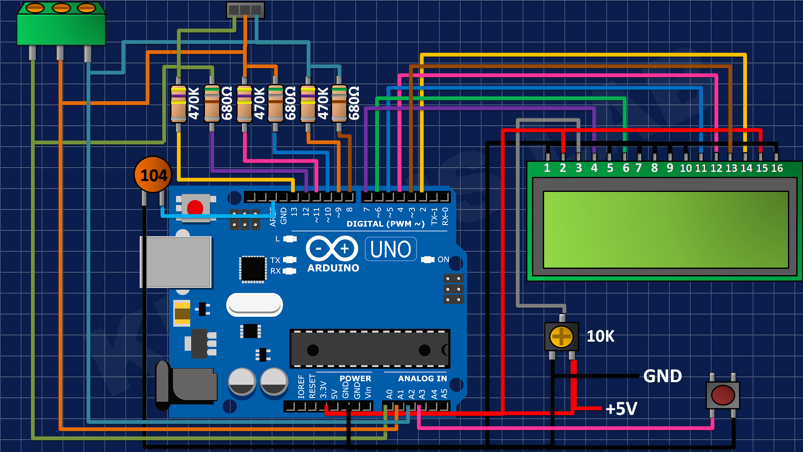

# Electronic Components Tester using Arduino
This repository contains the code and documentation for building an electronic components tester using an Arduino. The tester can identify and test various electronic components such as resistors, capacitors, diodes, transistors, and more. It is designed for hobbyists and engineers who want a quick and easy way to check the functionality of components.

**Features**
 - Resistor Measurement: Measures resistance values and identifies the type of resistor (fixed, variable).
 - Capacitor Testing: Measures the capacitance of capacitors.
 - Diode Testing: Identifies the polarity of diodes and checks forward voltage drop.
 - Transistor Testing: Identifies the type of transistor (NPN, PNP) and tests its functionality.
 - LED Testing: Checks if an LED is functional and lights it up.
 - Button Interface: Simple interface for selecting the component to test.
 - Display: Results are shown on a 16x2 LCD or OLED display.

